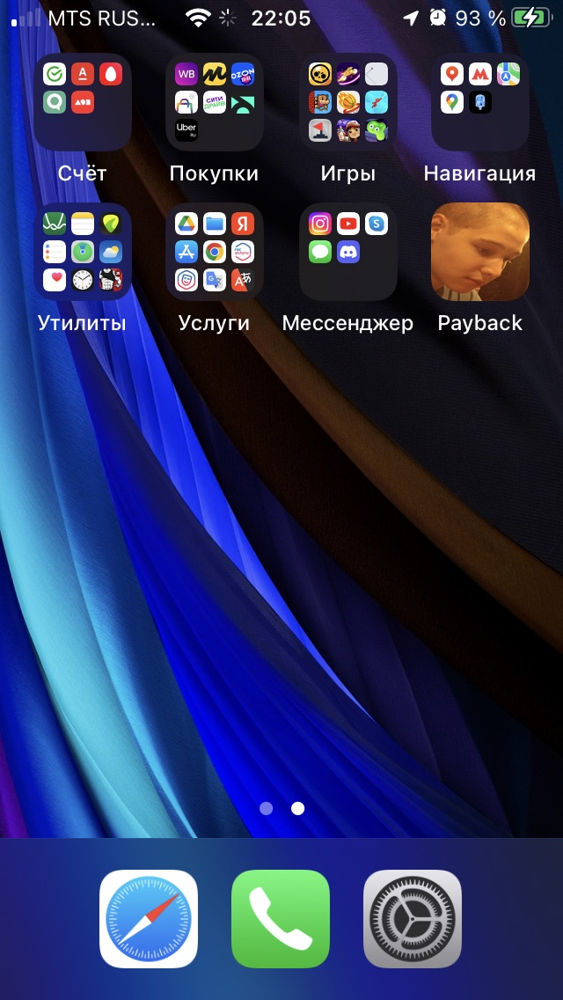
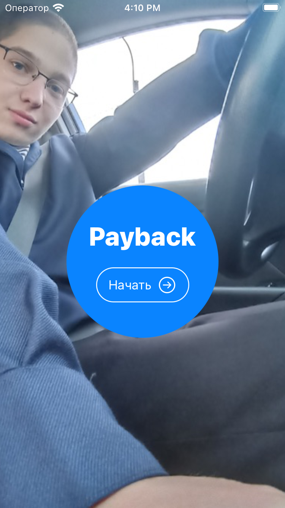
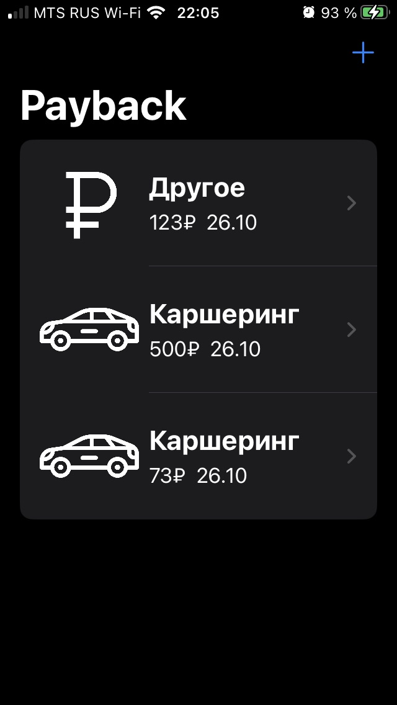
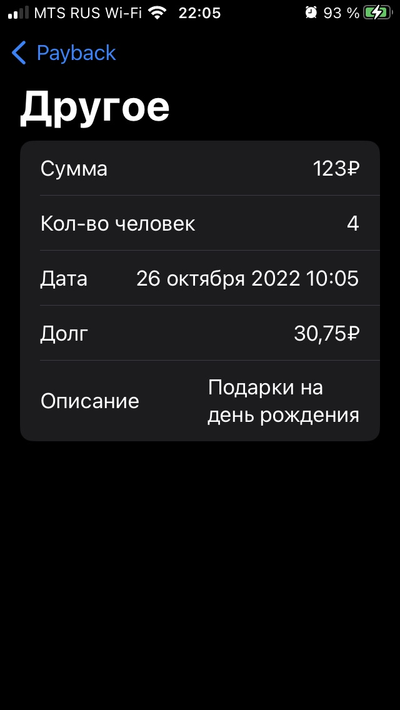
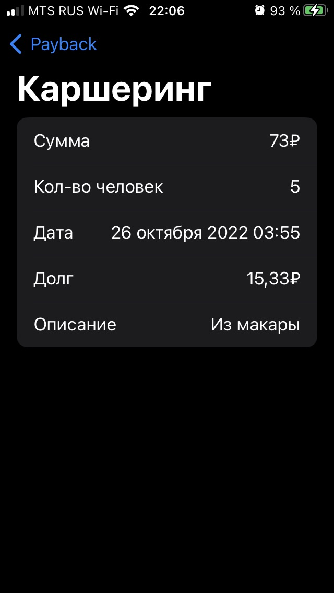
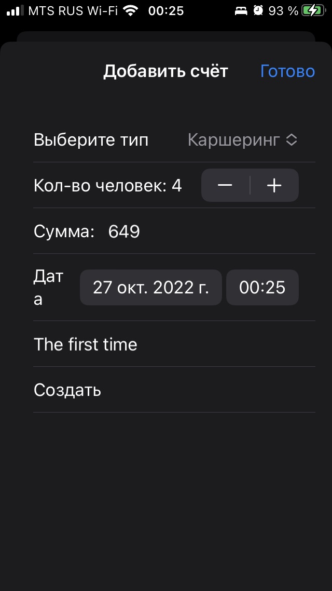

# Payback

Приложение под iOS на SwiftUI для распределения денег между людьми после общей покупки/аренды.

 |  |    
При выборе "Другое" сумма делится пополам - на всех людей, по дефолту стоит "Каршеринг" - тут немного другая формула (водителю капает динамический процент, колеблющийся от кол-ва людей)  
 |   
Дата по дефолту - текущая  

